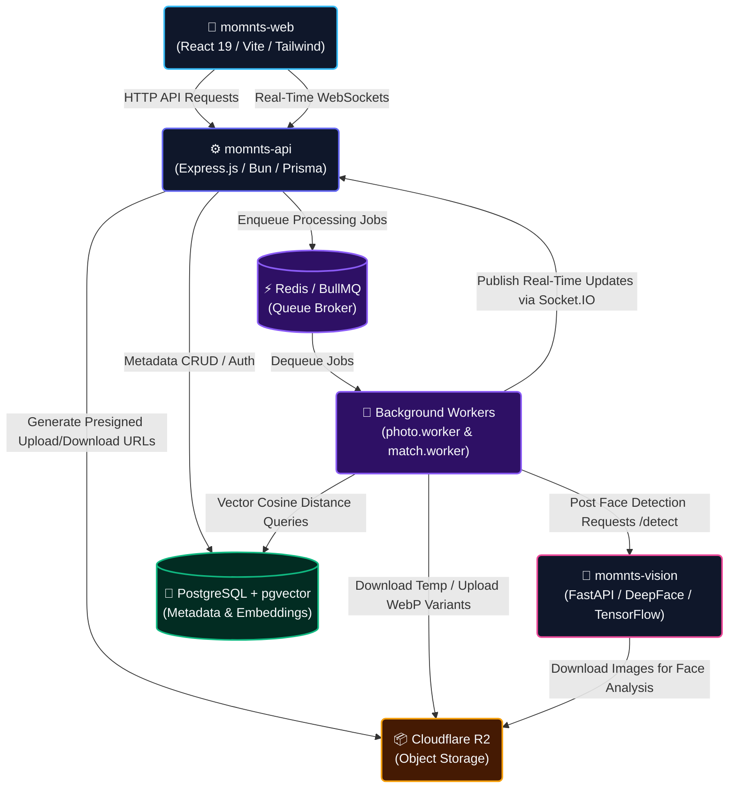
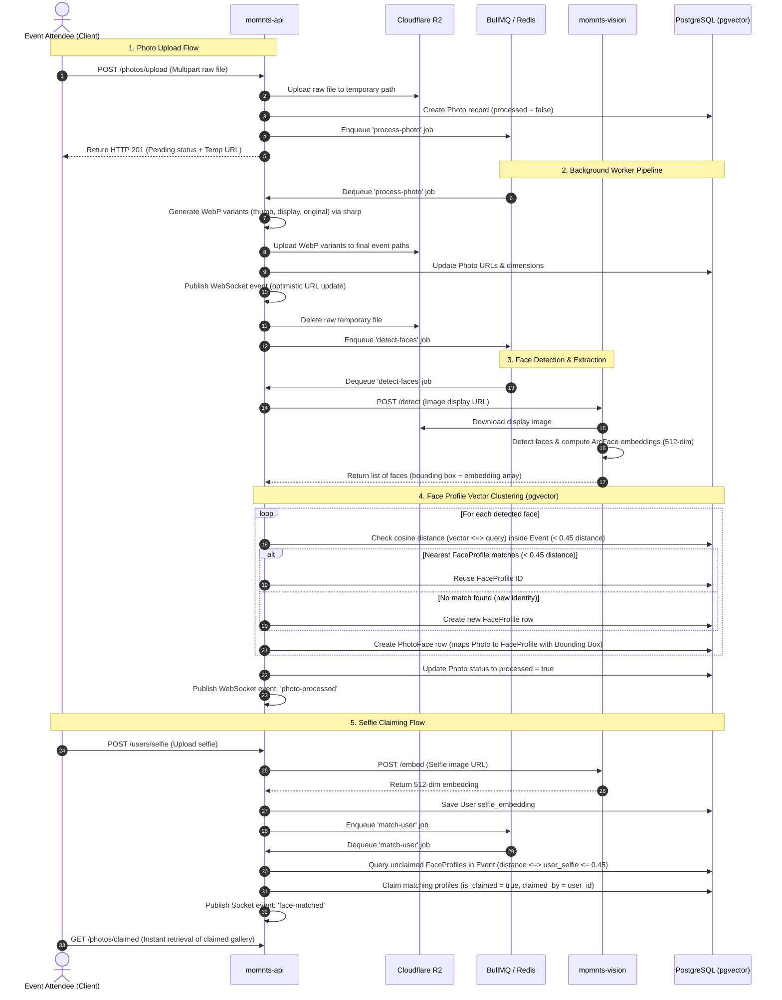
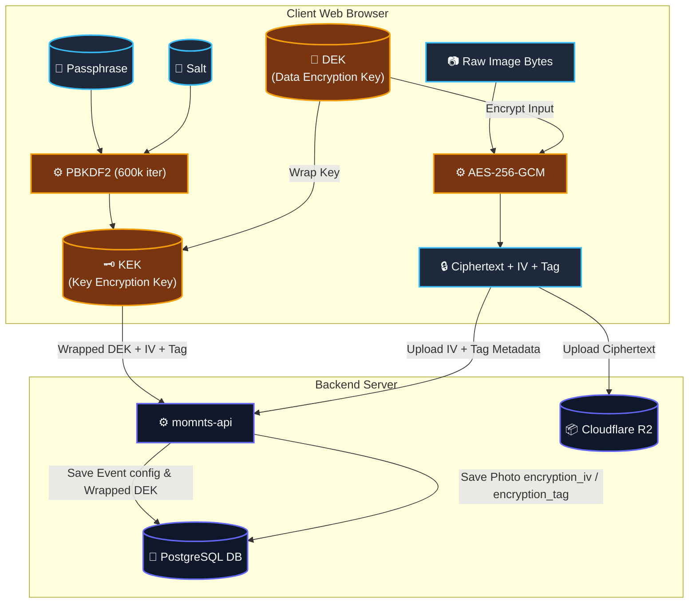

# Momnts — Identity-Based, AI-Powered Event Photo Sharing & Secure Collaboration

Momnts is a modern, full-stack, identity-based photo retrieval and collaboration platform designed for events. Organizers can create events with custom restrictions, while attendees join via secure invite codes. 

The application supports two distinct operational modes:
1. **AI Clustering Mode:** Photos uploaded by attendees are processed asynchronously in the background. A computer vision microservice detects faces, generates vector embeddings, and clusters them. Attendees register a selfie to dynamically match their face and instantly retrieve all photos featuring them.
2. **End-to-End Encrypted (E2EE) Mode:** Organizers specify a passphrase to generate secure AES-256-GCM data encryption keys (DEKs) on the client side. Photos, captions, and chat messages are encrypted client-side using WebCrypto APIs before upload. No decryption key ever leaves the user's browser, providing extreme security and total privacy.

---

## Key System Features

*   👤 **AI-Driven Selfie Photo Retrieval:** Automatic face detection using **RetinaFace** and 512-dimension vector embedding generation using the **ArcFace** model.
*   ⚡ **Asynchronous Background Processing:** Seamless non-blocking uploads via a dual-worker queue architecture powered by **BullMQ** and **Redis**.
*   🔒 **End-to-End Encryption (E2EE):** High-grade client-side encryption using AES-256-GCM with Key Encryption Keys (KEKs) derived via PBKDF2 (600,000 iterations). Includes a 24-character alphanumeric recovery key system.
*   💬 **Real-Time Interactive Chat & Reactions:** In-event chat messaging with file attachments, nested replies, real-time Socket.IO notifications, and custom emoji reactions.
*   🛡️ **Strict Multi-Tenant Isolation:** Database and service level scoping. Data access is authorized strictly using event-based junction tables (`EventAccess`) to prevent cross-tenant data leaks.
*   📦 **Cloud-Native Storage & Assets:** Direct-to-storage uploads of original, display-optimized, and thumbnail WebP variants using **Cloudflare R2** (S3 compatible) storage.
*   💳 **Subscription Tiers:** Custom plan-limited restrictions (Free vs. Pro) controlling upload limits and event scopes.

---

## System Architecture

Momnts is built on a distributed microservices architecture comprised of a React client, a Bun-powered Node REST API, background queue workers, and a Python FastAPI deep learning service.

### Components Architecture Diagram



### 1. Frontend Client ([momnts-web](file:///Users/shaikmohammadasrarahammad/Downloads/MyProjects/momnt-dep/momnts-web))
A single-page React 19 application. It manages local authentication states, handles Socket.IO listeners for real-time notifications, facilitates the WebCrypto encryption/decryption keys workspace, runs local image optimization, and streams photo galleries.

### 2. Backend API ([momnts-api](file:///Users/shaikmohammadasrarahammad/Downloads/MyProjects/momnt-dep/momnts-api))
A TypeScript backend running on Bun and Express.js. It acts as the core gateway, orchestrating CRUD operations, validation limits, JWT session rotations, signed R2 asset access, and Socket.IO servers. It publishes tasks to Redis and consumes database updates via Prisma.

### 3. Background Workers ([momnts-api/src/workers](file:///Users/shaikmohammadasrarahammad/Downloads/MyProjects/momnt-dep/momnts-api/src/workers))
Asynchronous task handlers powered by BullMQ:
*   [photo.worker.ts](file:///Users/shaikmohammadasrarahammad/Downloads/MyProjects/momnt-dep/momnts-api/src/workers/photo.worker.ts): Handles image resizing/WebP variant generation (original, display, thumb) using `sharp`, uploads them to R2, triggers face detection endpoints, and executes database mutations.
*   [match.worker.ts](file:///Users/shaikmohammadasrarahammad/Downloads/MyProjects/momnt-dep/momnts-api/src/workers/match.worker.ts): Performs the high-dimensional pgvector cosine similarity scans against active event face profiles.

### 4. Computer Vision Microservice ([momnts-vision](file:///Users/shaikmohammadasrarahammad/Downloads/MyProjects/momnt-dep/momnts-vision))
A Python 3.10+ FastAPI microservice built to perform heavy computational face modeling. It houses the **DeepFace** engine (utilizing the **RetinaFace** backend for high-accuracy face extraction and **ArcFace** model weights for 512-dimension vector representations).

---

## Data Flow Diagrams

### AI Photo Processing & Face Matching Pipeline
This sequence diagram shows how an uploaded photo goes through async variant generation, face detection, clustering, selfie matching, and real-time frontend updates:



### End-to-End Encryption (E2EE) Lifecycle
This diagram illustrates how client-side cryptographic keys are created, wrapped, and utilized to encrypt data prior to database or bucket ingestion:



---

## Domain Database Model & Schema

Momnts relies on PostgreSQL with the native extensions `vector` (pgvector) enabled. All tables are handled using the Prisma ORM. Below is an overview of the core entities in the schema:

| Table | Primary Identifier | Fields & Keys | Relationship Description |
| :--- | :--- | :--- | :--- |
| **`User`** | `id` (UUID) | `name`, `email` (Unique), `password_hash`, `selfie_url`, `selfie_embedding` (`vector(512)`), `theme`, `clerk_user_id` | Core user identity. Owns events, photos, claims, and subscriptions. |
| **`Event`** | `id` (UUID) | `user_id` (FK), `name`, `location`, `date`, `invite_code` (Unique), `is_active`, `is_secure`, `encryption_mode` (`AI` or `E2EE`), `kdf_salt`, `wrapped_dek` | Event scope container. Manages upload limits, cover photo, and E2EE wrapped key params. |
| **`EventAccess`** | `id` (UUID) | `event_id` (FK), `user_id` (FK), `role` (`ORGANIZER` or `ATTENDEE`), `upload_count`, `upload_limit` | Junction table mapping access permissions. Enforces access scoping and limits. |
| **`Photo`** | `id` (UUID) | `event_id` (FK), `user_id` (FK), `uploaded_at`, `processed` (Boolean), `original_url`, `display_url`, `thumb_url`, `encryption_iv`, `encryption_tag` | Photo record metadata. Links to R2 asset links. In E2EE mode, stores ciphertext parameters. |
| **`FaceProfile`** | `id` (UUID) | `event_id` (FK), `embedding_vector` (`vector(512)`), `claimed_by` (FK, Nullable), `is_claimed` | Unique physical face identity clustered within a specific Event. |
| **`PhotoFace`** | `id` (UUID) | `photo_id` (FK), `face_profile_id` (FK, Nullable), `bbox_x`, `bbox_y`, `bbox_w`, `bbox_h`, `confidence` | Relational bridge linking a physical face box inside a photo file to a FaceProfile. |
| **`ChatMessage`** | `id` (UUID) | `event_id` (FK), `user_id` (FK), `parent_id` (FK, Nullable), `message_text`, `encryption_iv`, `encryption_tag` | In-event chat message entity. Supports E2EE payload wrapping. |
| **`MessageReaction`**| `id` (UUID) | `chat_message_id` (FK), `user_id` (FK), `emoji` (VarChar) | Real-time emoji reaction. |
| **`Subscription`** | `id` (UUID) | `user_id` (FK, Unique), `plan` (`FREE` or `PRO`), `is_active`, `expires_at` | Billing tier container. Dictates limits and active feature access. |
| **`JoinRequest`** | `id` (UUID) | `event_id` (FK), `user_id` (FK), `status` (`PENDING`, `APPROVED`, `REJECTED`) | Junction permissions table for secure events. |
| **`RefreshToken`** | `id` (UUID) | `token` (Unique), `user_id` (FK), `expires_at`, `device_name`, `ip_address` | Session management and security rotations. |
| **`Blacklist`** | `id` (UUID) | `token` (Unique), `expires_at` | Revoked JWT tokens tracking registry. |

---

## Technical Stack & Dependencies

```
┌────────────────────────────────────────────────────────────────────────┐
│                              FRONTEND                                  │
├───────────────────┬────────────────────────────────────────────────────┤
│ Framework         │ React 19, Vite, TypeScript                         │
├───────────────────┼────────────────────────────────────────────────────┤
│ Styling & Icons   │ Tailwind CSS, Shadcn UI, Phosphor Icons            │
├───────────────────┼────────────────────────────────────────────────────┤
│ State Management  │ TanStack Query, Context APIs                       │
├───────────────────┼────────────────────────────────────────────────────┤
│ Real-Time         │ Socket.IO Client                                   │
└───────────────────┴────────────────────────────────────────────────────┘

┌────────────────────────────────────────────────────────────────────────┐
│                              BACKEND API                               │
├───────────────────┬────────────────────────────────────────────────────┤
│ Runtime / Gateway │ Bun runtime, Express.js, Node.js API compatibility │
├───────────────────┼────────────────────────────────────────────────────┤
│ ORM               │ Prisma ORM (v7)                                    │
├───────────────────┼────────────────────────────────────────────────────┤
│ Queue / Memory    │ Redis, BullMQ                                      │
├───────────────────┼────────────────────────────────────────────────────┤
│ Storage           │ Cloudflare R2 (compatible with @aws-sdk/client-s3) │
└───────────────────┴────────────────────────────────────────────────────┘

┌────────────────────────────────────────────────────────────────────────┐
│                             VISION SERVICE                             │
├───────────────────┬────────────────────────────────────────────────────┤
│ Runtime           │ Python 3.10+, Uvicorn                              │
├───────────────────┼────────────────────────────────────────────────────┤
│ Framework         │ FastAPI                                            │
├───────────────────┼────────────────────────────────────────────────────┤
│ Machine Learning  │ DeepFace (RetinaFace & ArcFace models), TensorFlow │
└───────────────────┴────────────────────────────────────────────────────┘
```

---

## Detailed Application Workflows

### 1. Photo Upload Pipeline
1. **Client Ingestion:** The attendee initiates an upload. If the event is in **AI Mode**, the raw image buffer is posted. If in **E2EE Mode**, the image is optimized and encrypted on the client side using AES-256-GCM and the locally cached DEK, before uploading the encrypted payload.
2. **Intermediate Buffering:** `momnts-api` receives the file via Multer. The file is uploaded to `temp-uploads/` inside R2, and a database row is created in `Photo` marked as `processed = false`.
3. **Queue Insertion:** A background job `process-photo` containing the metadata is enqueued in BullMQ. An instant success response containing a signed temporary URL is returned to the client to keep interactions fast and responsive.

### 2. Async Face Processing & Clustering
1. **Worker Consumption:** The `photo-processing` worker pops the `process-photo` job.
2. **Image Optimization:** The worker downloads the temp file, generates display-optimized and thumbnail WebP copies via `sharp`, and uploads them to the event's folder structure in Cloudflare R2.
3. **Face Analysis Request:** The API worker invokes the Python `momnts-vision` microservice via `/detect`, passing the presigned display image URL.
4. **Embedding Generation:** FastAPI downloads the image. **RetinaFace** crops the faces. For each face, **ArcFace** calculates a 512-dimension float vector representation.
5. **Clustering (pgvector):** The worker uses Prisma raw SQL to run a Cosine Distance search (`<=>` operator) against existing `FaceProfile` embeddings inside the event:
    $$\text{Cosine Distance} = 1 - \frac{\vec{A} \cdot \vec{B}}{\|\vec{A}\|\|\vec{B}\|}$$
6. **Decision Tree:**
    *   If the nearest neighbor distance is **under 0.45** (meaning similarity is above $0.55$), the face is linked to the existing profile.
    *   If the nearest neighbor distance is **above 0.45**, a new `FaceProfile` is created in PostgreSQL.
7. **Mapping:** A `PhotoFace` entry is stored mapping the bounding box coordinates, confidence score, and the matching `FaceProfile`. The `Photo` is marked `processed = true`, and a `photo-processed` Socket.IO broadcast alerts all listening clients.

### 3. Selfie Matching & Claiming
1. **Registration:** A user uploads a high-quality selfie via [e2ee.ts](file:///Users/shaikmohammadasrarahammad/Downloads/MyProjects/momnt-dep/momnts-web/src/lib/crypto/e2ee.ts) / `momnts-web`.
2. **Feature Extraction:** The API calls `momnts-vision` via `/embed` (hard-rejecting images if RetinaFace detects zero clear faces). The resulting 512-dimension vector is saved to `User.selfie_embedding`.
3. **Trigger Matching:** A BullMQ background job `match-user` is triggered.
4. **Vector Claim Execution:** The worker runs a distance search over all unclaimed `FaceProfiles` inside the event:
    ```sql
    SELECT fp.id, fp.embedding_vector <=> user.selfie_embedding AS distance
    FROM "FaceProfile" fp
    WHERE fp.event_id = :eventId AND fp.is_claimed = false
    ORDER BY distance ASC
    ```
5. **Claiming:** Profiles with a distance $\le 0.45$ are updated to `is_claimed = true` and `claimed_by = user_id`. A real-time Socket.IO event `face-matched` is pushed, triggering client-side gallery updates.

### 4. Client-Side E2EE Cryptography Flow
1. **Key Generation:** When an E2EE event is created via [CreateEventModal.tsx](file:///Users/shaikmohammadasrarahammad/Downloads/MyProjects/momnt-dep/momnts-web/src/pages/events/components/CreateEventModal.tsx), a random 256-bit AES Data Encryption Key (DEK) is generated in the browser:
    ```javascript
    crypto.subtle.generateKey({ name: 'AES-GCM', length: 256 }, true, ['encrypt', 'decrypt'])
    ```
2. **Key Encryption Key (KEK) Derivation:** A KEK is derived from the user's password and a random salt using PBKDF2-SHA256 at 600,000 iterations.
3. **Key Wrapping:** The KEK is used to wrap (encrypt) the DEK:
    ```javascript
    crypto.subtle.wrapKey('raw', dek, KEK, { name: 'AES-GCM', iv })
    ```
4. **Metadata Push:** The client uploads the wrapped DEK, salt, and KDF iterations to `momnts-api`. The raw DEK never leaves the browser.
5. **Recovery Path:** A random 24-character alphanumeric recovery key (e.g. `ABCD-EFGH-IJKL-MNOP-QRST-UVWX`) is generated. The DEK is wrapped again using a KEK derived from this recovery key and saved to the server.
6. **Local Storage Cache:** The decrypted DEK is cached in-memory during the active browser session.
7. **Asset Encryption:** When an attendee uploads an image, the file is encrypted locally:
    ```javascript
    crypto.subtle.encrypt({ name: 'AES-GCM', iv }, DEK, rawFileBytes)
    ```
    The ciphertext is uploaded to R2, and the IV & Authentication Tag are saved as strings in PostgreSQL.
8. **Decryption:** Browsers fetch the ciphertext and decrypt it locally using the cached DEK, rendering the image dynamically in the browser via `URL.createObjectURL(blob)`.

---

## Critical Security & Architectural Constraints

1.  🔒 **Strict Event Isolation:** All database transactions touching `Photo`, `FaceProfile`, `PhotoFace`, `ChatMessage`, or `Favourite` tables **must** filter on `event_id`. This prevents cross-tenant and cross-event data exposure.
2.  🔑 **EventAccess Authorization checks:** Do not verify permissions by querying `Event.user_id` (since events can have multiple organizers and attendees). Instead, always check security constraints against the [schema.prisma](file:///Users/shaikmohammadasrarahammad/Downloads/MyProjects/momnt-dep/momnts-api/prisma/schema.prisma) `EventAccess` junction table.
3.  ⚙️ **Non-Blocking API Architecture:** Heavy computation, image compression, and AI vision inference **must never** be run synchronously inside Express request/response cycles. Offload all intensive operations to BullMQ queues.
4.  🧬 **Vector Dimension Consistency:** Face vectors are constrained to exactly 512 dimensions. The PostgreSQL table columns (managed via `pgvector`), the FastAPI model endpoints (`/detect` & `/embed`), and the background workers must remain configured to this vector size.
5.  🚫 **E2EE Event Isolation:** E2EE event photos and chat messages do not have vector embeddings. Face processing workers (`photo.worker` / `match.worker`) must immediately exit if triggered on E2EE photos to avoid processing unreadable encrypted buffers.

---

## Local Installation & Run Guide

### Prerequisites
*   [Bun Runtime](https://bun.sh/) (or Node.js 18+)
*   [Python 3.10+](https://www.python.org/)
*   PostgreSQL with [pgvector](https://github.com/pgvector/pgvector) installed and enabled
*   Redis server running locally

---

### Step-by-Step Configuration

#### 1. Backend Service (`momnts-api`)
Navigate to the API folder and install the dependencies:
```bash
cd momnts-api
bun install
```

Configure your environment variables by creating `.env`:
```ini
DATABASE_URL="postgresql://<user>:<password>@localhost:5432/<database>?schema=public"
JWT_SECRET="generate-a-secure-jwt-secret-string"
AUTH_REFRESH_SECRET="generate-a-secure-refresh-jwt-secret-string"
AUTH_SECRET_EXPIRES_IN="15m"
AUTH_REFRESH_SECRET_EXPIRES_IN="24h"
APP_HOST="localhost"
APP_PORT=3000
PYTHON_SERVICE_URL="http://localhost:8000"
CLIENT_APP_URL="http://localhost:5173"

# Cloudflare R2 Object Storage Config
R2_ACCOUNT_ID="your-cloudflare-account-id"
R2_ACCESS_KEY_ID="your-access-key-id"
R2_SECRET_ACCESS_KEY="your-secret-access-key"
R2_BUCKET_NAME="your-bucket-name"
R2_PUBLIC_URL="https://pub-your-bucket-id.r2.dev"
R2_ENDPOINT_URL="https://your-account-id.r2.cloudflarestorage.com"

# BullMQ Redis Broker
REDIS_URL="redis://localhost:6379"
```

Initialize your PostgreSQL database and run the Prisma migrations:
```bash
bun prisma migrate dev
```

Start the API server in development mode:
```bash
bun run dev
```

---

#### 2. Computer Vision Service (`momnts-vision`)
Navigate to the vision microservice directory, create a Python virtual environment, and install libraries:
```bash
cd momnts-vision
python -m venv .venv
source .venv/bin/activate
pip install -r requirements.txt
```

Set up your local port environment:
```bash
echo "PORT=8000" > .env
```

To pre-download the RetinaFace and ArcFace model weight files (so your first request doesn't timeout while downloading models):
```bash
python prewarm.py
```

Run the Uvicorn ASGI application server:
```bash
uvicorn main:app --host 127.0.0.1 --port 8000 --reload
```

---

#### 3. Frontend Web Client (`momnts-web`)
Navigate to the web UI directory and install dependencies:
```bash
cd momnts-web
bun install
```

Configure the local backend API server endpoint in `.env`:
```ini
SERVER_URL="http://localhost:3000"
```

Start the Vite development web client:
```bash
bun run dev
```
The application will launch on [http://localhost:5173](http://localhost:5173).